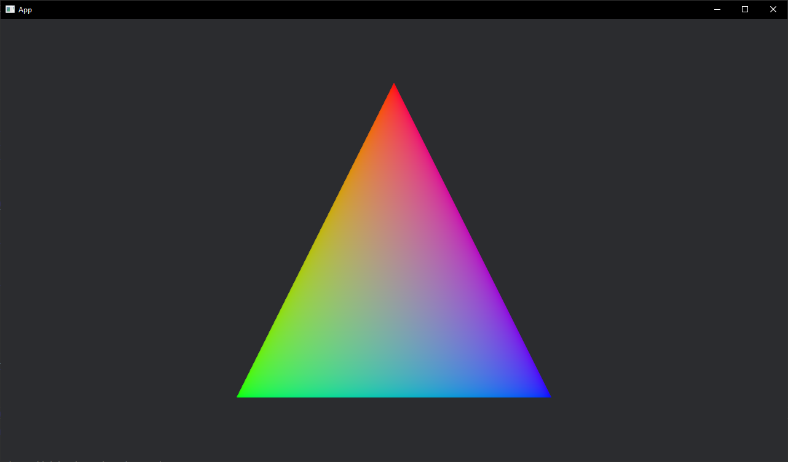

# Rainbow Triangle Rust

This repository contains an example of how to render a rainbow triangle implementation uing the BEVY game engine in rust.
This example is a more or less a copy of this example:
https://github.com/bevyengine/bevy/blob/main/examples/2d/mesh2d_vertex_color_texture.rs

## Overview

The rainbow triangle is a simple graphical demonstration created using Bevy, a data-driven game engine built in Rust.
This project aims to showcase the capabilities of Bevy and provide a starting point for exploring graphics programming in Rust. :)

## Features

- Render a colorful triangle using Bevy's 2D rendering capabilities
- Explore and modify the code to learn a bit about graphics programming in Rust

## Getting Started

* If run not already installed:
[https://rustup.rs/](https://www.rust-lang.org/learn/get-started)
* Clone the repo:
`git clone https://github.com/xeuc/rainbow_triangle_bevy`
`cd rainbow_triangle_bevy`
* Run the project:
`cargo run`
